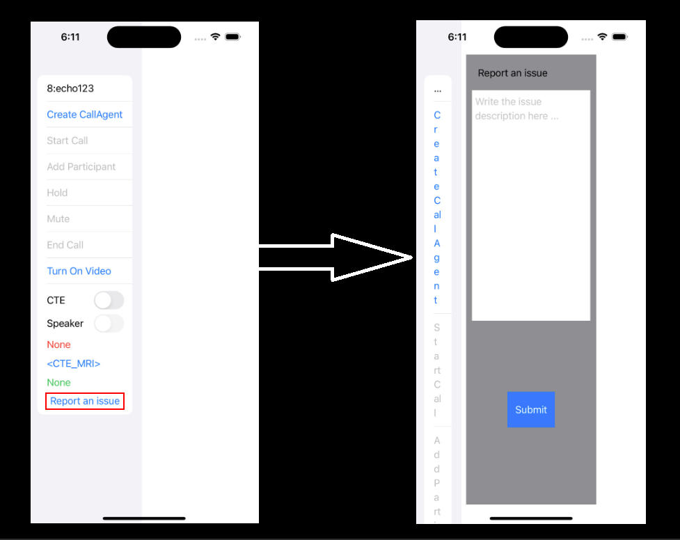
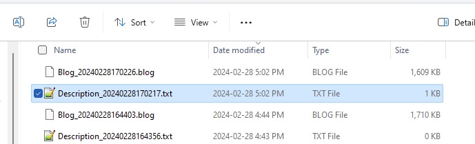

# Quickstart: Add 1 on 1 video calling to your app
In this quickstart we are going to get started with Azure Communication Services by using the Communication Services calling client library to add 1 on 1 video calling to your app. You'll learn how to start and answer a video call using the Azure Communication Services Calling client library for iOS.

## Prerequisites
- Obtain an Azure account with an active subscription. [Create an account for free](https://azure.microsoft.com/en-us/free/?WT.mc_id=A261C142F).
- A Mac running [Xcode](https://developer.apple.com/xcode/), along with a valid developer certificate installed into your Keychain.
- Create an active Communication Services resource. [Create a Communication Services resource](https://docs.microsoft.com/en-gb/azure/communication-services/quickstarts/create-communication-resource?tabs=windows&pivots=platform-azp).
- Create a User Access Token to instantiate the call client. [Learn how to create and manage user access tokens](https://docs.microsoft.com/en-gb/azure/communication-services/quickstarts/access-tokens?pivots=programming-language-csharp).

## Setting up
### Installing CocoaPods
Please use this guide to [install CocoaPods](https://guides.cocoapods.org/using/getting-started.html) on your Mac. 

### Install the package and dependencies with CocoaPods
1. To create a Podfile for your application open the terminal and navigate to the project folder and run pod init.

2. Add the following code to the Podfile and save:
```
platform :ios, '13.0'
use_frameworks!

target 'VideoCallingQuickstart' do
  pod 'AzureCommunicationCalling', '~> 2.8.0'
end
```
3. Run pod install.

##Application workflow with log file sharing
- When user press "Report an issue", a new view will appear to add issue descreption.
- When pressing on "Submit" button, a post method will go to "ACSNativeLogsCollector" application sending the issue descreption and all the .blog files to the machine that hosted that application.



*Here is a screenshot that shows the files sent to the ACSNativeLogsCollector, txt file for issue descreption and blog file for the logs.*



- 

## Run the code
- Before running the sample, you need to replace the following:
- "<USER_ACCESS_TOKEN>" with the User Access Token you created in prerequisites.
- "<YOUR_DEVTUNNEL_ENDPOINT>" with your devtunnel endpoint URL that will recieve the blog files
You can build an run your app on iOS simulator by selecting Product > Run or by using the (⌘-R) keyboard shortcut. 
